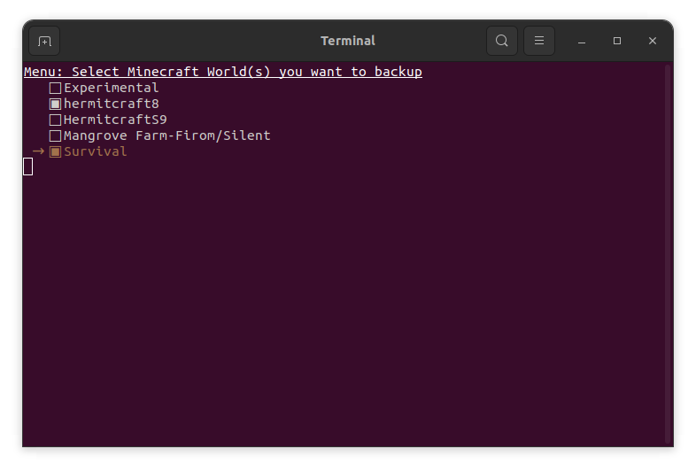

# Minecraft-World-Backup
 Minecraft world backup program using bash(shell) script with easy to use User Interface
 

# Usage
- **TUI Version**: 

**control**
    - up: up
    - down: down
    - space: select/unselect
    - enter: start backup
    - esc: end program
- **GUI Version**: Unfinished